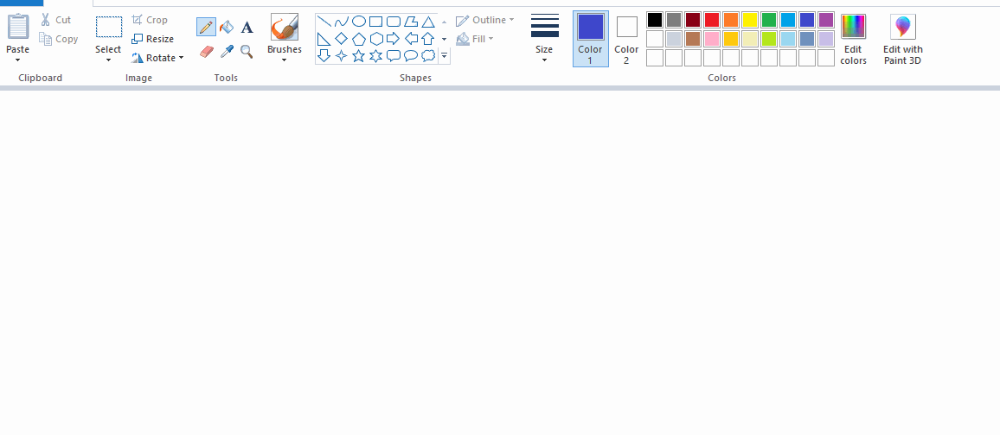

<style>
img {
  border: solid 2px #000;
  padding: 2px;
  width: 500px !important;
}
</style>

# keepMoving

Is a python script that draw some figures on a previuosly open and maximize paint window. This prevents the monitor for going to sleep.

## Prerequisites

Python 3

## Usage

- Open paint and maximize it
- Run the Script

```bash
python keepMoving.py
```

### Examples


